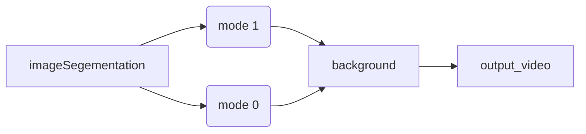

# Background_Segmentation <badge><badge></br>
 #Java #background_segmentation #image_segmentation #background_subtraction </br>
## Video Demo


## Command
### Fist compile the file</br></br>

```
 javac imageSegementation.java
```

### Then run</br>

```
Java imageSegementation basename_of_foreground base_name_of_background mode1
```

 or
 
``` 
Java imageSegementation basename_of_background_subtraction base_name_of_background mode0
```
#### **** mode 0 is used to extract objects from green screen video </br>
#### **** while mode 1 is used to extract objects from a real world video </br>
#### **** Note that basename should include the path to the file</br>
#### **** (futher explantion see below section "Basename explanation")</br>

To make it easier to understand, we can plot it as a flow chart

## Use sample input to test
You can find these files in the corresponding repository</br>
You can also try out any video you like</br></br>
### Basename explanation
For the command line you have to type in the basename of the frames including its path</br>
for example, if you have 480 frames of foreground file</br>
ranging from "aaa/bbb/ccc_ccc.0000.rgb" to "aaa/bbb/ccc_ccc.0479.rgb" </br>
then you should type in "aaa/bbb/ccc_ddd"</br>
same goes with background file</br></br></br>
